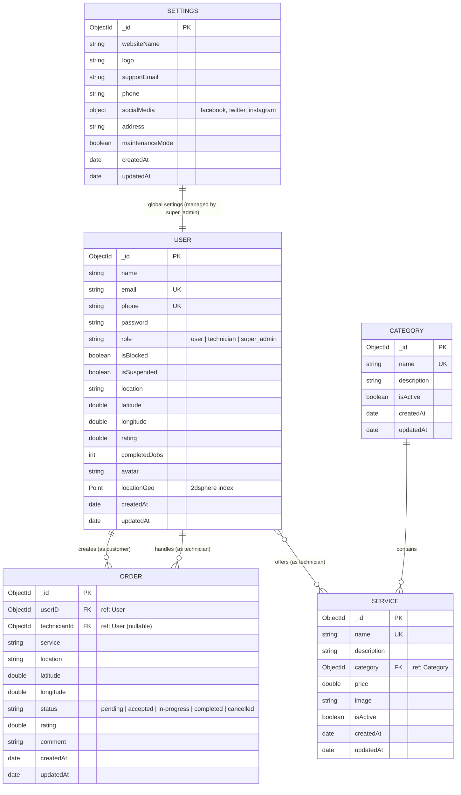

# 🚗 صيانتك (Sa2yanti) - Smart Vehicle Maintenance Platform

[](https://react.dev/)
[](https://www.typescriptlang.org/)
[](https://nodejs.org/)
[](https://expressjs.com/)
[](https://www.mongodb.com/)
[](https://leafletjs.com/)
[](https://opensource.org/licenses/MIT)

**صيانتك (Sa2yanti)** هي منصة إلكترونية متكاملة تربط أصحاب المركبات بالفنيين ومراكز الصيانة القريبة جغرافيًا بشكل مباشر وتفاعلي، مع تزويد لوحات التحكم للأعضاء وللإدارة الفائقة لتسهيل وتنظيم دورة حياة الصيانة بالكامل.

---

## 📋 جدول المحتويات (Table of Contents)
1. [نظرة عامة على المشروع (Project Overview)](#-نظرة-عامة-على-المشروع-project-overview)
2. [المشكلة والحل (The Problem & The Solution)](#-المشكلة-والحل-the-problem--the-solution)
3. [أدوار النظام والمميزات بالتفصيل (System Roles & Detailed Features)](#-أدوار-النظام-والمميزات-بالتفصيل-system-roles--detailed-features)
4. [مخططات النظام والعمليات (System Diagrams)](#-مخططات-النظام-والعمليات-system-diagrams)
   - [مخطط العلاقات لقاعدة البيانات (ERD)](#أولاً-مخطط-علاقات-الكيانات-entity-relationship-diagram---erd)
   - [مخطط حالات الاستخدام (Use Case Diagram)](#ثانياً-مخطط-حالات-الاستخدام-use-case-diagram)
5. [دورة حياة الطلب (Request Lifecycle)](#-دورة-حياة-الطلب-request-lifecycle)
6. [البنية التقنية (Tech Stack)](#-البنية-التقنية-tech-stack)
7. [هيكلية المشروع (Project Architecture)](#-هيكلية-المشروع-project-architecture)
8. [توثيق واجهة برمجية التطبيقات (API Documentation)](#-توثيق-واجهة-برمجية-التطبيقات-api-documentation)
9. [طريقة التثبيت والتشغيل محلياً (Installation & Local Setup)](#-طريقة-التثبيت-والتشغيل-محلياً-installation--local-setup)
10. [التحسينات المستقبلية (Future Roadmap)](#-التحسينات-المستقبلية-future-roadmap)
11. [الترخيص والمطور (License & Author)](#-الترخيص-والمطور-license--author)

---

## 🌟 نظرة عامة على المشروع (Project Overview)
تم تصميم وتطوير منصة **صيانتك** لتكون الحل الرقمي الأمثل لإصلاح وتغطية متطلبات صيانة السيارات في أي مكان وزمن. يهدف النظام إلى تمكين أصحاب السيارات من تقديم طلبات صيانة سريعة بالاعتماد على **الموقع الجغرافي الحي (Live Geolocation)**، وتوجيهها للفنيين القريبين وفقًا لنظام فحص إحداثيات ثنائي الأبعاد المعتمد على **MongoDB 2dsphere Geospatial Index**. يضم النظام كذلك بوابة حماية متطورة وبوابة إدارة فائقة للتحكم الشامل ببيانات وإعدادات الموقع.

---

## ⚠️ المشكلة والحل (The Problem & The Solution)

### 🔴 المشكلة (The Problem)
* **صعوبة العثور على فني موثوق** في المناطق القريبة خاصة عند حدوث أعطال مفاجئة على الطريق.
* **غياب الشفافية** في أسعار الصيانة والخدمات المقدمة.
* **صعوبة التواصل والتتبع** المباشر لحالة طلبات الصيانة.
* **عدم وجود منصة موحدة** تجمع بيانات أصحاب المركبات ومزودي الخدمة، وإجراءات تقييم جودة الخدمة.
* **البيروقراطية والإدارة اليدوية** لمراكز الصيانة والفنيين.

### 🟢 الحل (The Solution)
* **اكتشاف جغرافي فوري**: توفير خريطة تفاعلية باستخدام **Leaflet & OpenStreetMap** للبحث عن أقرب الفنيين وحساب المسافة بدقة بالاعتماد على إحداثيات المتصفح.
* **دورة طلبات مرنة**: إمكانية رفع العميل لطلب صيانة يحدد الخدمة المطلوبة والموقع بدقة، مع استقبال فوري للفنيين القريبين للقبول أو الرفض.
* **تقييمات متبادلة**: نظام تقييم وتعليق شفاف يبني ثقة متبادلة ويحفز الفنيين على تقديم أفضل جودة.
* **لوحة تحكم إدارية فائقة (Super Admin Portal)**: تحكم كامل بالمستخدمين (حظر/تنشيط)، الفنيين (تعليق/تنشيط)، الفئات، الخدمات، الطلبات، إحصائيات مالية، وتعديل إعدادات الموقع بالكامل.

---

## 👥 أدوار النظام والمميزات بالتفصيل (System Roles & Detailed Features)

### 1️⃣ العميل (Customer - User)
* **تسجيل الحساب والدخول الآمن**: حماية كاملة بـ JWT المخزن في كوكيز آمنة (HTTP-Only).
* **الملف الشخصي التفاعلي**: إمكانية تحديث الاسم، رقم الهاتف، الموقع المكتوب، والموقع الجغرافي التفاعلي عبر الخريطة.
* **طلب صيانة جديد**: اختيار الفئة والخدمة المطلوبة، مع رصد تلقائي لموقعه الحالي عبر GPS.
* **البحث عن فنيين قريبين**: خريطة تفاعلية تعرض أماكن أقرب مراكز الصيانة والفنيين المتاحين حوله وحساب المسافات الفاصلة بالكيلومتر.
* **تتبع الطلبات وتفاصيلها**: قائمة تفاعلية تعرض حالة الطلب (قيد الانتظار، مقبول، جاري التنفيذ، مكتمل، ملغي).
* **التقييم والتعليقات**: تقييم الفني بعد إتمام الخدمة بنظام النجوم وإضافة تعليق نصي يظهر بملفه الشخصي.

### 2️⃣ الفني (Technician)
* **استقبال الطلبات القريبة**: لوحة تحكم تعرض فوراً الطلبات المقدمة في محيطه الجغرافي.
* **القبول والرفض**: إمكانية قبول الطلب لتظهر بيانات العميل ورقم هاتفه وموقعه الجغرافي على الخريطة، أو تجاهل الطلب.
* **إدارة حالات العمل**: تحديث حالة الطلب الحالي (جاري العمل عليه `in-progress` ➡️ تم الاكتمال `completed`).
* **إحصائيات الأداء**: عرض عدد المهام المكتملة ومتوسط التقييم الحالي الخاص به من العملاء.
* **تحديد نطاق الخدمات**: ربطه تلقائيًا بالخدمات التي يقدمها لتحديد ملاءمته للطلب.

### 3️⃣ الإدارة الفائقة (Super Admin)
* **لوحة المؤشرات والإحصائيات (KPI Dashboard)**: شاشات تفاعلية تعرض إجمالي المستخدمين، إجمالي الفنيين، إجمالي الخدمات، وتفاصيل الطلبات وحالاتها.
* **إدارة المستخدمين (User Management)**: استعراض العملاء، البحث بالاسم والبريد، وحظر/إلغاء حظر الحسابات، أو حذف الحساب نهائياً لمنع الانتهاكات.
* **إدارة الفنيين (Technician Management)**: مراجعة قوائم الفنيين، تعليق نشاط الفني، تنشيطه، وحذف الحسابات التالفة.
* **إدارة فئات الصيانة (Categories CRUD)**: إنشاء وتحديث وحذف وتفعيل الفئات الرئيسية (مثل: صيانة المحركات، نظام الفرامل، الكهرباء، تكييف الهواء).
* **إدارة الخدمات (Services CRUD)**: إنشاء خدمات فرعية بأسعار محددة، وصف تفصيلي، وربطها بالفئات المناسبة.
* **إدارة الطلبات (Orders Management)**: التحكم بكافة طلبات الصيانة الجارية أو السابقة، وإمكانية تعديل الحالات أو حذفها.
* **الإحصائيات المتقدمة (Advanced Statistics)**: رسومات بيانية ومخططات تفاعلية لمعدلات نمو التسجيل، توزيع الطلبات، وأكثر الخدمات طلباً.
* **إعدادات النظام العامة (System Settings)**: تخصيص اسم الموقع، الشعار (Logo)، البريد الداعم، الهاتف، روابط التواصل الاجتماعي وعنوان المقر الرئيسي، وتفعيل **وضع الصيانة (Maintenance Mode)** بضغطة زر.

---

## 📊 مخططات النظام والعمليات (System Diagrams)

### أولاً: مخطط علاقات الكيانات (Entity Relationship Diagram - ERD)
يوضح هذا المخطط الهيكلي التفاعلي لقاعدة بيانات **MongoDB** والعلاقات بين الجداول المختلفة (المستخدمين، الطلبات، الخدمات، الفئات، والإعدادات):



---

### ثانياً: مخطط حالات الاستخدام (Use Case Diagram)
يوضح المخطط التالي تفاعل مختلف الجهات الفاعلة (العميل، الفني، المسؤول الفائق) مع العمليات الأساسية للمنصة:

```mermaid
graph TD
    %% Actors
    Customer((العميل))
    Technician((الفني))
    Admin((المسؤول الفائق))

    %% Customer Use Cases
    subgraph Customer_Actions ["صلاحيات العميل"]
        UC1(إنشاء حساب / تسجيل دخول)
        UC2(إنشاء طلب صيانة جديد)
        UC3(تتبع حالة طلباته الحالية)
        UC4(البحث عن الفنيين القريبين بالخريطة)
        UC5(تقييم وإضافة مراجعة للفني)
        UC6(تحديث الملف الشخصي والموقع الجغرافي)
        UC7(عرض سجل الطلبات السابق)
    end

    %% Technician Use Cases
    subgraph Technician_Actions ["صلاحيات الفني"]
        UC8(تسجيل فني وضبط الخدمات)
        UC9(استقبال الطلبات القريبة جغرافياً)
        UC10(قبول أو رفض طلب الصيانة)
        UC11(تحديث حالة العمل إلى جاري/مكتمل)
        UC12(متابعة التقييمات والتعليقات الواردة)
        UC13(رصد إحصائيات الأداء الشخصي)
    end

    %% Super Admin Use Cases
    subgraph Admin_Actions ["صلاحيات المسؤول الفائق"]
        UC14(دخول لوحة التحكم الفائقة)
        UC15(مراقبة إحصائيات وأداء النظام)
        UC16(إدارة وحظر وتنشيط العملاء)
        UC17(إدارة وتعليق وتفعيل الفنيين)
        UC18(تحديث وحذف وإدارة الطلبات)
        UC19(إدارة وتحديث فئات الصيانة)
        UC20(إدارة وتحديث الخدمات والأسعار)
        UC21(تعديل إعدادات الموقع ووضع الصيانة)
    end

    %% Connections
    Customer --> UC1
    Customer --> UC2
    Customer --> UC3
    Customer --> UC4
    Customer --> UC5
    Customer --> UC6
    Customer --> UC7

    Technician --> UC8
    Technician --> UC9
    Technician --> UC10
    Technician --> UC11
    Technician --> UC12
    Technician --> UC13

    Admin --> UC14
    Admin --> UC15
    Admin --> UC16
    Admin --> UC17
    Admin --> UC18
    Admin --> UC19
    Admin --> UC20
    Admin --> UC21
```



---

## 🔄 دورة حياة الطلب (Request Lifecycle)

```
[العميل] يرفع طلب صيانة بالخدمة والموقع
       │
       ▼
[النظام] يسجل الطلب كحالة قيد الانتظار (pending)
       │
       ▼
[النظام] يقوم بالبحث الجغرافي وإعلام الفنيين القريبين (Geo-spatial Query)
       │
       ▼
[الفني] يضغط قبول للطلب (Accept Order)
       │
       ├─► تتغير الحالة إلى مقبول (accepted)
       ├─► يُغلق الطلب أمام بقية الفنيين
       └─► تظهر بيانات التواصل والمسافة بين الطرفين
       │
       ▼
[الفني] يبدأ العمل ──► تتغير الحالة إلى جاري العمل (in-progress)
       │
       ▼
[الفني] ينهي العمل ──► تتغير الحالة إلى مكتمل (completed)
       │
       ▼
[العميل] يقيم الفني ──► يتم تحديث متوسط تقييم الفني في قاعدة البيانات
```

---

## 🛠️ البنية التقنية (Tech Stack)

### 💻 واجهة المستخدم (Frontend)
* **React 19**: لتطوير واجهة مستخدم تفاعلية وسريعة الاستجابة.
* **TypeScript 5**: لضمان كتابة كود برمجى خالٍ من الأخطاء وواجهات صارمة (Strict Typing).
* **Vite 8**: بيئة عمل وتجميع تتميز بالسرعة الفائقة في البناء والتحديث المباشر.
* **Tailwind CSS 4**: لتصميم مظهر عصري يدعم التجاوب وشاشات العرض المظلمة والمضيئة بسهولة.
* **React Router Dom 7**: للتحكم في مسارات التطبيق وحمايتها بناءً على أدوار المستخدمين.
* **Leaflet & React Leaflet 5**: لتمثيل الخرائط التفاعلية وإشارات المواقع.
* **React Hook Form & Zod**: لبناء استمارات آمنة، خالية من الأخطاء، والتحقق التلقائي من المدخلات.
* **Axios**: للتعامل مع طلبات الـ HTTP وإرسال واستقبال البيانات من الخادم.

### ⚙️ الخادم والمنطق البرمي (Backend)
* **Node.js**: البيئة التشغيلية الأساسية لكود الجافاسكربت على الخادم.
* **Express.js 5**: إطار العمل المعتمد لتأسيس مسارات الـ REST API بسهولة وأمان.
* **Mongoose 9**: لتمثيل ونمذجة جداول قاعدة بيانات **MongoDB** والتعامل مع كود الاستعلام الجغرافي.
* **TypeScript 5**: لكتابة كود الخادم بالكامل بهيكلية قوية خالية من الثغرات البرمجية.
* **JSON Web Token (JWT)**: لتأمين جلسات العمل وتوقيع الرموز الأمنية.
* **Cookie Parser**: لاستخراج وقراءة الرموز الموقعة المخزنة في الـ HTTP-only Cookies لتفادي هجمات XSS.
* **Joi Validation**: للتحقق التلقائي من صحة حمولة الطلبات المدخلة للخادم (Request Payload Validation).

### 🗄️ قواعد البيانات والخادم السحابي
* **MongoDB Atlas**: قاعدة البيانات السحابية القائمة على تخزين المستندات (Document-oriented NoSQL DB).
* **Browser Geolocation API**: للحصول التلقائي على إحداثيات خطوط الطول ودائرة العرض للعميل.

---

## 📁 هيكلية المشروع (Project Architecture)

يتبع المشروع بنية المجلدات المنظمة للفصل الكامل بين واجهة المستخدم والمنطق الخلفي (Monorepo-like Folder Structure):

```
Sa2yanti/
├── backend/                  # خادم المنصة (Node/Express/TS)
│   ├── src/
│   │   ├── config/           # إعدادات الاتصال بقاعدة البيانات
│   │   ├── controllers/      # المنطق التنفيذي لوظائف الـ APIs
│   │   ├── middleware/       # برمجيات التحقق والتأمين والتحقق من الأدوار
│   │   ├── models/           # نماذج قاعدة البيانات (Mongoose Models)
│   │   ├── routes/           # مسارات الـ API وتقسيمها
│   │   ├── utils/            # الأدوات المساعدة و نصوص البذر (Seeding)
│   │   ├── validators/       # التحقق من صحة مدخلات الطلب (Joi Schemas)
│   │   ├── app.ts            # تهيئة تطبيق Express والبرمجيات الوسيطة
│   │   └── server.ts         # نقطة انطلاق الخادم والاتصال بالـ DB
│   ├── tsconfig.json
│   └── package.json
│
├── frontend/                 # واجهة المستخدم (Vite/React/TS)
│   ├── src/
│   │   ├── admin/            # مجلد مستقل بالكامل لبوابة المسؤول الفائق
│   │   │   ├── context/      # حالة حماية المسؤول الفائق
│   │   │   ├── layout/       # تصميم وتخطيط البوابة والقوائم الجانبية
│   │   │   ├── pages/        # صفحات الإدارة (العملاء، الفنيين، الطلبات، الإعدادات، الفئات)
│   │   │   ├── routes/       # حماية وتوجيه صفحات المسؤول
│   │   │   └── services/     # الاتصال بمنافذ الـ API الخاصة بالمسؤول
│   │   ├── components/       # المكونات العامة التفاعلية (أزرار، خرائط، بطاقات)
│   │   ├── hooks/            # الخطافات المخصصة لإدارة العمليات (Custom Hooks)
│   │   ├── pages/            # صفحات العميل والفني (الرئيسية، القريبون، الطلبات، الملف الشخصي)
│   │   ├── routes/           # التوجيه العام وحماية المستخدمين والفنيين
│   │   ├── services/         # قنوات الاتصال بالـ Backend العام
│   │   ├── types/            # تعريفات أنواع البيانات الثابتة لـ TS
│   │   ├── index.css         # ملف التصميم الرئيسي ورموز المتغيرات
│   │   └── main.tsx          # نقطة انطلاق تطبيق React وتثبيته
│   ├── tsconfig.json
│   └── package.json
│
├── documentation/            # ملفات التوثيق، عروض تقديمية ومخططات
└── README.md                 # ملف دليل المنصة الرئيسي
```

---

## 🔌 توثيق واجهة برمجية التطبيقات (API Documentation)

تتطلب جميع المسارات (ما عدا العامة) ترويسة تفويض أو وجود رمز المصادقة في الـ Cookie لتنفيذ الطلب:

### 🔑 مسارات المستخدمين والمصادقة (`/api/auth`)
| المنفذ | الطريقة | الحماية | الوصف | الحمولة المتوقعة (Request Body) |
| :--- | :--- | :--- | :--- | :--- |
| `/register` | `POST` | 🔓 عام | تسجيل عميل أو فني جديد | `{ name, email, phone, password, role }` |
| `/login` | `POST` | 🔓 عام | تسجيل الدخول وتثبيت الكوكي | `{ email, password }` |
| `/logout` | `POST` | 🔓 عام | تسجيل الخروج ومسح الكوكي | لا يوجد |
| `/me` | `GET` | 🔐 محمي | استرجاع بيانات المستخدم الحالي وسياقه | لا يوجد |
| `/profile` | `GET` | 🔐 محمي | جلب تفاصيل الملف الشخصي الكامل | لا يوجد |
| `/profile` | `PUT` | 🔐 محمي | تحديث بيانات الحساب والموقع الجغرافي | `{ name, phone, location, latitude, longitude }` |
| `/services` | `GET` | 🔓 عام | جلب كافة الخدمات النشطة بالموقع | لا يوجد |
| `/settings` | `GET` | 🔓 عام | جلب إعدادات الموقع العامة والمعلومات | لا يوجد |

### 🛠️ مسارات الطلبات وإدارتها (`/api/orders`)
| المنفذ | الطريقة | الحماية | الأدوار المسموح بها | الوصف | الحمولة المتوقعة |
| :--- | :--- | :--- | :--- | :--- | :--- |
| `/` | `POST` | 🔐 محمي | `user`, `admin` | إنشاء طلب صيانة جديد | `{ service, location, latitude, longitude }` |
| `/` | `GET` | 🔐 محمي | الكل | جلب الطلبات وفق الصلاحيات | لا يوجد |
| `/my` | `GET` | 🔐 محمي | `user` | استرجاع الطلبات التي رفعها العميل | لا يوجد |
| `/available`| `GET` | 🔐 محمي | `technician`, `admin`| جلب الطلبات القريبة المتاحة للفني | لا يوجد (يعتمد على موقع الفني) |
| `/:id/accept`| `POST`| 🔐 محمي | `technician`, `admin`| قبول فني لطلب صيانة محدد | لا يوجد |
| `/my-jobs` | `GET` | 🔐 محمي | `technician`, `admin`| استعراض الوظائف المقبولة للفني | لا يوجد |
| `/:id/status`| `PATCH`| 🔐 محمي | `technician`, `admin`| تعديل حالة الطلب الجاري | `{ status: 'in-progress' / 'completed' }` |
| `/:id/rate` | `POST` | 🔐 محمي | `user` | تقييم الفني بعد اكتمال الطلب | `{ rating: 1-5, comment: string }` |

### 📍 مسارات استكشاف الفنيين (`/api/technicians`)
| المنفذ | الطريقة | الحماية | الأدوار المسموح بها | الوصف | معلمات الاستعلام (Query Params) |
| :--- | :--- | :--- | :--- | :--- | :--- |
| `/nearby` | `GET` | 🔐 محمي | `user` | جلب الفنيين القريبين بالمسافة الجغرافية | `lat`, `lng`, `maxDistance` |
| `/:id` | `GET` | 🔐 محمي | الكل | جلب تفاصيل فني محدد مع مراجعاته | لا يوجد |

### 👑 مسارات المسؤول الفائق والتحكم الشامل (`/api/admin`)
جميع هذه المسارات محمية ببرمجية `adminAuth` التي تتحقق من دور `super_admin`:

| المنفذ | الطريقة | الوصف | الحمولة المتوقعة / معلمات الاستعلام |
| :--- | :--- | :--- | :--- |
| `/login` | `POST` | تسجيل دخول المسؤول الفائق (بدون حماية) | `{ email, password }` |
| `/logout` | `POST` | تسجيل خروج المسؤول | لا يوجد |
| `/me` | `GET` | جلب بيانات المسؤول المسجل حالياً | لا يوجد |
| `/dashboard` | `GET` | استرجاع إحصائيات عامة والطلبات الأخيرة | لا يوجد |
| `/users` | `GET` | جلب العملاء مع محرك البحث والتصفح | `page`, `limit`, `search` |
| `/users/:id/block` | `PATCH` | حظر حساب عميل ومنعه من تسجيل الدخول | لا يوجد |
| `/users/:id/unblock` | `PATCH` | إلغاء حظر عميل | لا يوجد |
| `/users/:id` | `DELETE`| حذف حساب مستخدم تماماً من النظام | لا يوجد |
| `/technicians` | `GET` | جلب الفنيين مع محرك البحث والتصفح | `page`, `limit`, `search` |
| `/technicians/:id/suspend`| `PATCH` | تعليق نشاط فني ومنعه من استقبال الأعمال | لا يوجد |
| `/technicians/:id/activate`| `PATCH` | تنشيط حساب فني معلق | لا يوجد |
| `/orders` | `GET` | جلب كافة طلبات الصيانة بالبحث والفرز | `page`, `limit`, `status`, `search` |
| `/orders/:id` | `PATCH` | تعديل يدوي لبيانات أو حالة أي طلب صيانة | `{ status, technicianId, service }` |
| `/orders/:id` | `DELETE`| حذف طلب صيانة من السجلات | لا يوجد |
| `/categories` | `GET` | جلب كافة الفئات الأساسية | لا يوجد |
| `/categories` | `POST` | إنشاء فئة صيانة رئيسية جديدة | `{ name, description }` |
| `/categories/:id` | `PATCH` | تعديل بيانات فئة صيانة | `{ name, description, isActive }` |
| `/categories/:id` | `DELETE`| حذف فئة صيانة نهائياً | لا يوجد |
| `/services` | `GET` | جلب جميع الخدمات بالموقع | لا يوجد |
| `/services` | `POST` | إنشاء خدمة جديدة وربطها بفئة | `{ name, description, price, category, isActive }` |
| `/services/:id` | `PATCH` | تعديل بيانات خدمة وسعرها وحالتها | `{ name, description, price, category, isActive }` |
| `/services/:id` | `DELETE`| حذف خدمة نهائياً | لا يوجد |
| `/statistics` | `GET` | جلب بيانات تفصيلية ورسومات للمخططات | لا يوجد |
| `/settings` | `GET` | جلب إعدادات المنصة بالكامل للمسؤول | لا يوجد |
| `/settings` | `PATCH` | تعديل الإعدادات والروابط ووضع الصيانة | تعديل أي حقل من حقول إعدادات الموقع |

---

## 🚀 طريقة التثبيت والتشغيل محلياً (Installation & Local Setup)

### المتطلبات الأساسية (Prerequisites)
* بيئة تشغيل **Node.js** إصدار 18 أو أحدث.
* قاعدة بيانات **MongoDB** (محلياً أو حساب Atlas سحابي).
* مدير الحزم **NPM** أو **Yarn**.

---

### 1️⃣ إعداد وتشغيل الخادم الخلفي (Backend Setup)

1. انتقل إلى مجلد الـ backend:
   ```bash
   cd backend
   ```

2. قم بتثبيت الحزم البرمجية المطلوبة:
   ```bash
   npm install
   ```

3. قم بإنشاء ملف المتغيرات البيئية باسم `.env` في المجلد الرئيسي للـ `backend` واملأه بالمتغيرات التالية:
   ```env
   PORT=5000
   SECRET_KEY=YourSuperSecureJWTSecretKeyHere
   MONGO_URI=mongodb+srv://<username>:<password>@cluster.mongodb.net/sa2yanti?retryWrites=true&w=majority
   ```
   > 💡 *يمكنك أيضاً استخدام مسار محلي لقاعدة البيانات مثل: `mongodb://localhost:27017/sa2yanti`*

4. **بذر البيانات تلقائياً (Database Seeding)**:
   عند تشغيل الخادم لأول مرة، يقوم النظام تلقائياً باستدعاء دالة البذر في الملف `src/utils/seed.ts` والتي تقوم بإنشاء:
   * حساب المسؤول الفائق الافتراضي: **`admin@sa2yanti.com`** بكلمة مرور **`Admin@123`**
   * الفئات الأساسية والخدمات باللغة العربية مع أسعارها.
   * إعدادات الموقع الافتراضية.
   * فنيين تجريبيين في القاهرة والمنيا بإحداثيات تفاعلية لتجربة البحث الجغرافي فوراً.

5. قم بتشغيل الخادم في وضع التطوير:
   ```bash
   npm run dev
   ```
   سيتم تشغيل الخادم بنجاح على المنفذ `http://localhost:5000`.

---

### 2️⃣ إعداد وتشغيل الواجهة الأمامية (Frontend Setup)

1. افتح نافذة سطر أوامر جديدة وانتقل لمجلد الـ frontend:
   ```bash
   cd frontend
   ```

2. قم بتثبيت حزم المكونات:
   ```bash
   npm install
   ```

3. قم بتشغيل تطبيق الويب محلياً:
   ```bash
   npm run dev
   ```
   سيفتح المتصفح تلقائياً ويعمل التطبيق على المسار: `http://localhost:5173`.

---

### 🧪 الحسابات التجريبية للتجربة السريعة (Demo Accounts)

للبدء في استكشاف النظام وتجربة المزايا الحية الجغرافية فوراً، يمكنك تسجيل الدخول بالبيانات التالية:

| الدور | البريد الإلكتروني (Email) | كلمة المرور (Password) | الملاحظات |
| :--- | :--- | :--- | :--- |
| **مسؤول فائق (Super Admin)** | `admin@sa2yanti.com` | `Admin@123` | للتحكم بلوحة الإدارة الكاملة عبر الرابط `/admin` |
| **فني تجريبي (Cairo Tech)** | `ahmed@tech.com` | `Tech@123` | فني يقع في القاهرة (جسر السويس)، تقييم 4.8 |
| **فني تجريبي (Minia Tech)** | `mostafa@tech.com` | `Tech@123` | فني يقع في المنيا (العدوة)، تقييم 4.9 |
| **عميل تجريبي** | قم بإنشاء حساب عميل جديد من صفحة Register برقم هاتف وموقع |

---

## 🔮 التحسينات المستقبلية (Future Roadmap)
* **تشخيص الأعطال بالذكاء الاصطناعي (AI Diagnostic)**: فحص أسباب أعطال السيارات بناءً على الأعراض المدخلة وتوجيه العميل للخدمة المناسبة تلقائياً.
* **تتبع الفني لحظياً على الخريطة (Live Tracking)**: دمج تقنية الويب سوكت (WebSockets/Socket.io) لمتابعة مسار تحرك الفني باتجاه العميل مباشرة.
* **بوابة الدفع الإلكتروني (Online Payment)**: توفير بوابات دفع آمنة مثل (فوري، فيزا، ماستر كارد) لدفع مستحقات الصيانة إلكترونياً.
* **نظام حجز المواعيد المسبق (Booking Scheduler)**: تمكين أصحاب السيارات من حجز مواعيد صيانة مجدولة مع مراكز الصيانة الكبيرة.
* **تطبيقات الهواتف المحمولة (Mobile Applications)**: تحويل المنصة إلى تطبيقات native لهواتف Android و iOS باستخدام React Native أو Flutter.

---

## 📝 الترخيص والمطور (License & Author)

* **المطور المنجز للعمل**: **ربيع شعبان (Rabea Shaban)** - Full Stack Software Engineer (MERN Stack Developer).
* **الترخيص**: هذا المشروع مرخص تحت رخصة **MIT** المفتوحة - راجع ملف [LICENSE](LICENSE) للمزيد من التفاصيل.

---

<div align="center">
صُنع بحب ودقة لتطوير منظومة صيانة السيارات الذكية في العالم العربي ❤️
</div>
